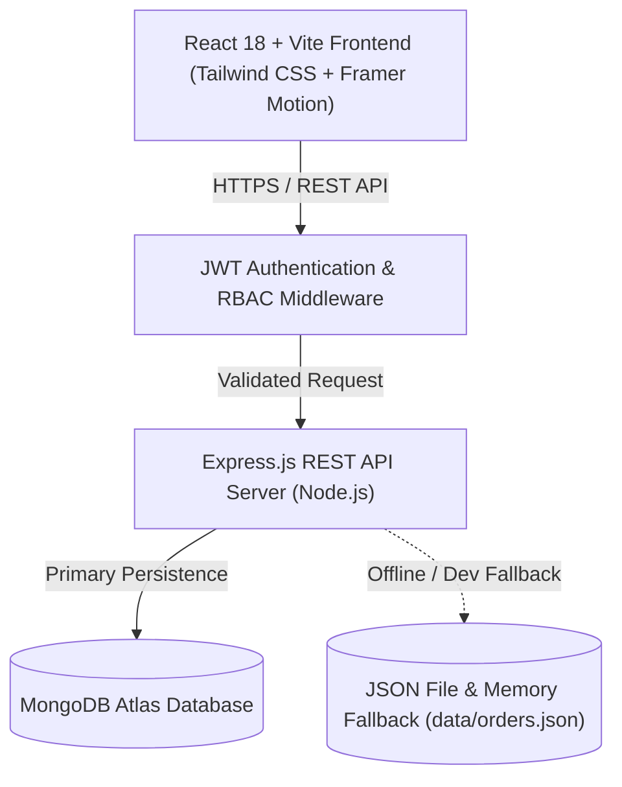

# 🛒 ShopKart — Modern Full-Stack E-Commerce Model Blueprint

[](https://www.typescriptlang.org/)
[](https://reactjs.org/)
[](https://vitejs.dev/)
[](https://nodejs.org/)
[](https://expressjs.com/)
[](https://tailwindcss.com/)

> **ShopKart** is a production-grade, full-stack E-Commerce application designed as an architectural reference model for building modern web applications. Featuring a sleek Kokonut-styled visual design system, real-time multi-tab state synchronization, multi-currency conversion, role-based access control (RBAC), and a zero-config hybrid database fallback system.

---

## 🌟 Key Highlights & Features

### 🛍️ Customer Experience & Portal
- **Interactive Product Catalog**: Grid & list views with category filters, dynamic search, price range sliders, and tag filtering.
- **Multi-Currency Support**: Real-time currency switching between **INR (₹)**, **USD ($)**, **EUR (€)**, and **GBP (£)** with auto-formatted monetary values.
- **Cart & Wishlist Systems**: Instant drawer cart with coupon validation, quantity adjustments, and persistent wishlist saving.
- **Live Order Tracking**: Interactive step-by-step visual timeline tracking order progress from confirmation to final delivery.
- **Self-Service Order Cancellation**: Active orders can be cancelled directly by customers from their Profile Order History.

### 🛡️ Admin Management Suite
- **Analytics & Metrics**: Visual Chart.js combo charts comparing monthly revenue & order volume against targeted KPIs.
- **Paginated Inventory & Orders**: High-performance paginated tables (8 items/page on Admin, 5 items/page on User Profile) with live search and status filters.
- **Kokonut Animated Dropdowns**: Framer Motion powered animated dropdown pills for status updating (`Order Placed`, `Processing`, `Shipped`, `Out for Delivery`, `Delivered`, `Cancelled`, `Refunded`).
- **Full Refund Workflow**: Permanent refund processing that updates payment, fulfillment, and order status across server memory and database persistence.

### ⚡ Real-Time Multi-Tab Synchronization
- Built-in `BroadcastChannel` messaging (`shopkart_orders_sync_channel`) ensures that state changes made in one browser tab (e.g. order placement or admin status update) instantly reflect across all active tabs without page refreshes.

---

## 🏗️ System Architecture & Design

### High-Level Architecture Diagram



### Security Architecture
- **Password Protection**: Passwords are salted & hashed using `bcrypt` and strictly excluded from API outputs (`select('-password')`).
- **Role-Based Access Control**: Protected administrative routes use `protect` and `isAdmin` middleware guards.
- **Session Purge on Sign-Out**: Event-driven token and local cart removal upon logout, instantly redirecting sessions to the Home route (`/`).

---

## 🎨 Design System & Aesthetics

ShopKart uses a custom Kokonut visual design language built on top of Tailwind CSS and Framer Motion:

- **Color Palette**: Tailwind neutral darks paired with vibrant accents (`emerald-500`, `amber-500`, `purple-500`, `rose-500`, `cyan-500`).
- **Glassmorphism & Micro-Interactions**: Soft backdrop blur filters, pill badges with inset glow shadows, and spring transition overlays.
- **Typography**: Clean sans-serif layout hierarchy with explicit monospace order IDs.

---

## 🚀 Step-by-Step Installation & Local Setup

Follow these instructions to run ShopKart on your local machine.

### 📋 Prerequisites
- **Node.js** (v18.0.0 or higher)
- **npm** (v9.0.0 or higher)
- *(Optional)* **MongoDB** instance (Local or MongoDB Atlas)

---

### 1. Clone the Repository

```bash
git clone https://github.com/Aryanuser07/ShopKart.git
cd ShopKart
```

---

### 2. Environment Configuration

Copy the provided sample `.env.example` template to `.env` in the `server/` directory:

```bash
cp server/.env.example server/.env
```

#### Sample `server/.env.example` Layout:

```env
# Server Network & Environment
PORT=5000
NODE_ENV=development
CLIENT_URL=http://localhost:5173

# Database Connection
MONGO_URI=mongodb://localhost:27017/shopkart

# Security & JWT Tokens
JWT_SECRET=your_jwt_secret_key_here
JWT_REFRESH_SECRET=your_jwt_refresh_secret_key_here
ADMIN_EMAIL=admin@shopkart.com

# SMTP Email Configuration
SMTP_HOST=smtp.gmail.com
SMTP_PORT=587
EMAIL_USER=your_email@gmail.com
EMAIL_PASS=your_gmail_app_password
```

---

### 3. Install Dependencies

#### Server Installation:
```bash
cd server
npm install
```

#### Client Installation:
```bash
cd ../client
npm install
```

---

### 4. Running the Application

#### Start the Server:
```bash
cd server
npm run dev
```
*Server starts on `http://localhost:5000`.*

#### Start the Frontend Client:
```bash
cd client
npm run dev
```
*Frontend opens at `http://localhost:5173`.*

---

## 🔐 Default Demo Accounts

ShopKart includes pre-seeded accounts for immediate testing:

| Role | Email | Password | Access Rights |
| :--- | :--- | :--- | :--- |
| **Admin** | `admin@shopkart.com` | `admin123` | Full access to Admin Dashboard, Orders Suite, Inventory & Refunds. |
| **Customer** | `customer@shopkart.com` | `customer123` | Catalog access, Checkout, Wishlist & Personal Order History. |

---

## 🐳 DevOps & Containerization

ShopKart includes a fully containerized deployment environment and automated CI/CD pipeline:

### 1. Docker & Docker Compose Setup
Run the entire stack (React Nginx frontend, Express Node.js backend, and MongoDB database) with a single command:

```bash
docker compose up --build -d
```

- **Client**: Hosted via Nginx on port `80` with API reverse proxy to the backend container.
- **Server**: Multi-stage Alpine container running on port `5000`.
- **Database**: MongoDB 7.0 persistent container running on port `27017`.

To stop the containers:
```bash
docker compose down
```

### 2. CI/CD Pipeline (GitHub Actions)
Automated testing and build verification are configured in `.github/workflows/ci.yml`:
- **Automated Verification**: Runs TypeScript compilation and Vite production builds on every push to `main`/`master`.
- **Docker Validation**: Automatically validates `docker-compose` build configurations.

---

## 🛠️ Built With

- **Frontend**: [React 18](https://react.dev/), [Vite](https://vitejs.dev/), [TypeScript](https://www.typescriptlang.org/), [Tailwind CSS](https://tailwindcss.com/), [Framer Motion](https://www.framer.com/motion/), [Lucide React](https://lucide.dev/), [Chart.js](https://www.chartjs.org/)
- **Backend**: [Node.js](https://nodejs.org/), [Express.js](https://expressjs.com/), [Mongoose](https://mongoosejs.com/), [JSONWebToken](https://jwt.io/), [BcryptJS](https://github.com/dcodeIO/bcrypt.js)
